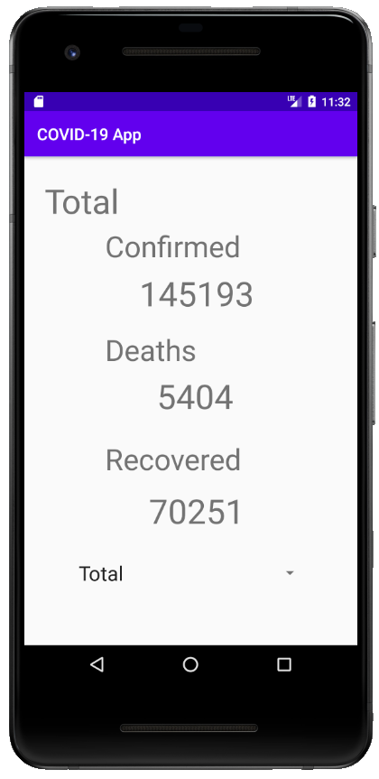
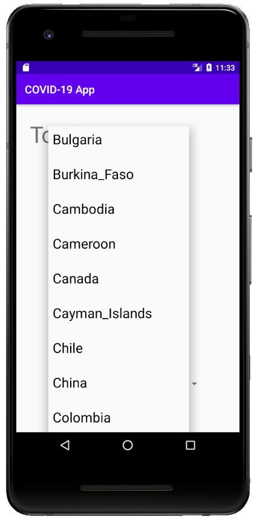

# COVID19 App
Demonstration Video: http://lukas-graber.tk/projects/covid19_app.html  

This app provides numbers for confirmed, dead and recovered cases for each country affected by the COVID19 virus. COVID19 API class can easily be extended for more functionality.

